# 菁英班作业第5课

## 环境

真机：华为nova7 HarmonyOS 3.0 未root

IDA pro

## 项目目录

Crackme2_unupx: Crackme2脱upx壳

assets: 说明文档图片目录

说明文档.pdf

## 一、CrackMe1分析

### 1、实验环境搭建

adb连接手机。

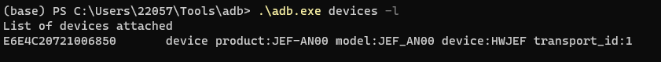

将可执行文件push进手机。

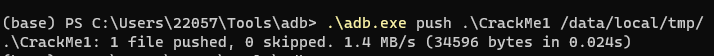

进入adb shell中，给CrackMe1可执行权限。

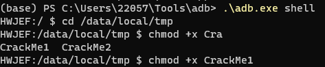

初步运行，输入1，显示错误答案。

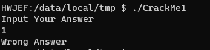

分析其可能采用字符串比较的方式进行跳转。

### 2、使用IDA进行静态分析


对main函数进行反编译

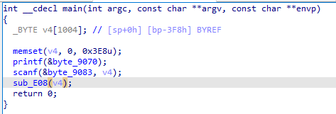

发现其先输出提示字符串"Input Your Answer"。

再读入字符串，保存在v4中。

将v4传入函数sub_E08。

进入函数sub_E08

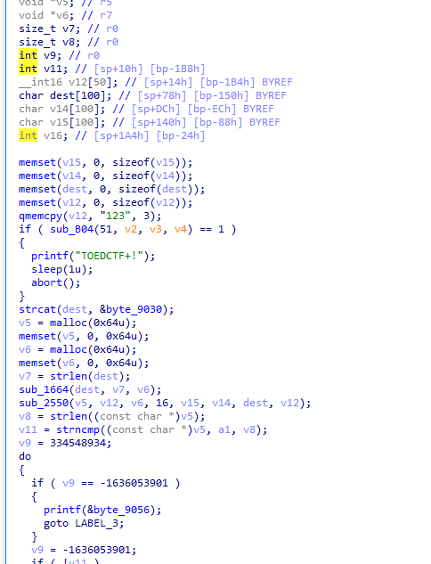

前面一部分内容暂且不管，发现函数调用strncmp

v11 = strncmp((const char *)v5, a1, v8);

其中的a1参数为传入的输入字符串地址，v8是v5的字符串长度。判断正确字符串保存在v5中。

而v5通过函数sub_2550得出。

进入函数sub_2550

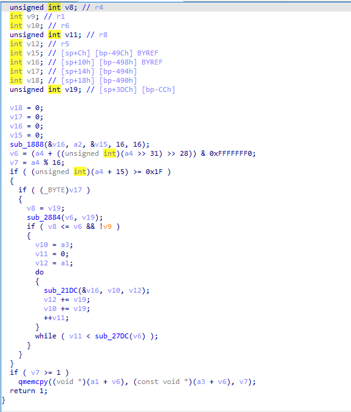

发现其函数实现较为复杂，故放弃静态分析正确字符串，转向动态分析。

记录其关键比较函数strncmp地址及其参数，在此位置设置断点

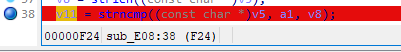

其参数位于R0,R1寄存器内

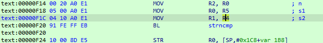

### 3、IDA动态调试环境搭建

将IDA自带的android_server传入手机中

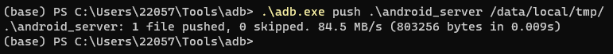

启动android_server

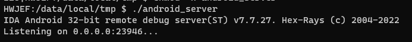

进行端口映射

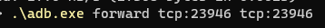

### 4、IDA动态调试

运行CrackMe1

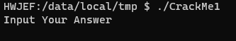

在strncmp处打下断点

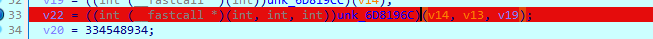

输入测试数据1，继续运行


产生中断，错误，判断其可能存在反调试策略。

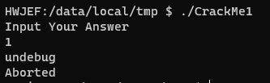

### 5、绕过反调试策略

静态分析发现此处存在printf与abort函数，在此处打下断点尝试

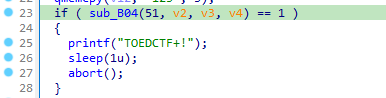

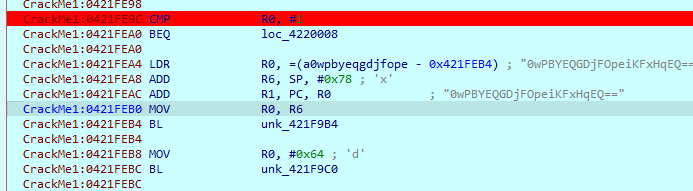

运行到此处，发现R0值为1

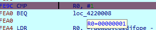

二者相等，则跳转至目的地址，输出undebug。

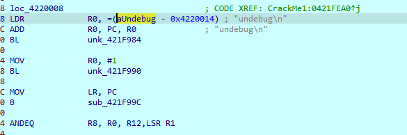

此处修改R0的值为0，让其不进行跳转。

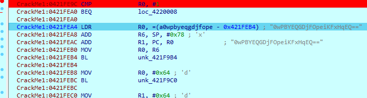

### 6、获取最终结果

运行至strncmp函数处。

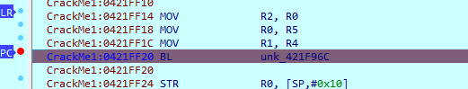

查看R0，R1寄存器内容。

R0：为正确字符串GameSecurity

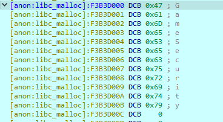

R1：为测试内容1

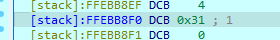

最终结果应为GameSecruity

### 7、测试获取的结果

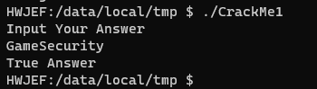

结果正确

## 二、CrackMe2分析

### 1、实验环境搭建

略

### 2、使用IDA进行静态分析

对start函数进行反编译

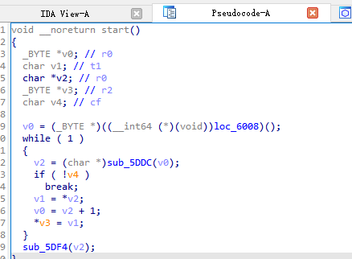

均为数据加载代码，判断其为加壳应用。

通过查看信息，判断其为upx加壳

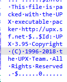

### 3、upx脱壳

使用upx工具进行脱壳

```shell
upx -d CrackMe2
```

脱壳成功

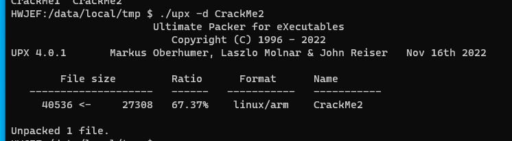

### 4、使用IDA进行静态分析脱壳后可执行文件

main函数与CrackMe1差不多

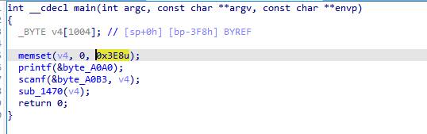

sub_1420函数

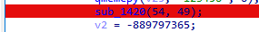

进入后发现可能与反调试有关

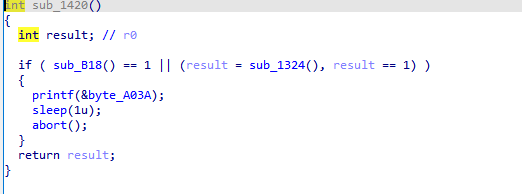

以下三个函数可能与字符串比较有关，动态调试时在此打下断点

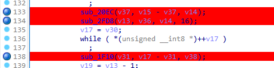

### 5、IDA动态调试

IDA尚未附加便检测到调试退出

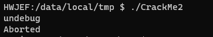

判断其存在检测android_server端口代码

修改android_server端口为22222

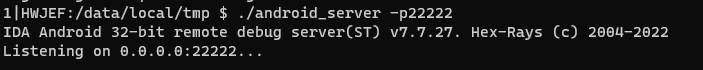

正常启动说明其绕过了检测


附加到CrackMe2上

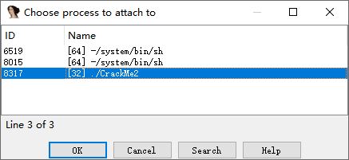

sub1420函数中存在输出undebug信息

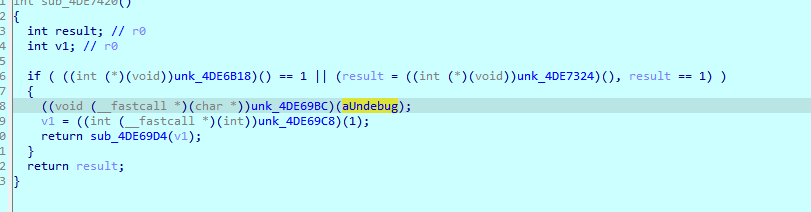

判断其为反调试

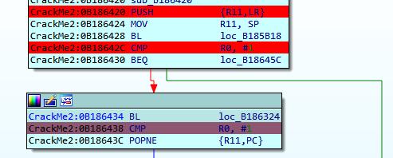

其中loc_B185B18函数为检测IDA android_server的tcp端口，loc_B186324为检测是否调试状态。

由于此前已经修改了端口，只需要修改第二次CMP R0, #1的指令即可。

将R0的值赋值为0即可绕过调试

接下来对于三个可疑函数调用进行分析

函数sub20EC:

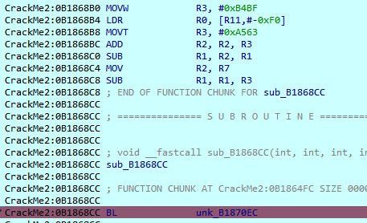

R0值为

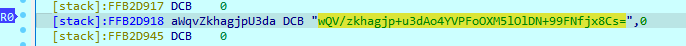

判断其应为base64加密后内容，但解码为乱码

R1为2c，R3地址处为空值，判断其应当不是字符串比较函数

函数sub_1FD8

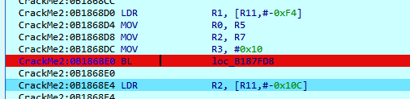

R0为R5的值

在函数执行完成后R5的位置发现一字符串

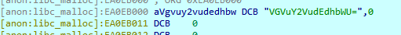

判断其为base64加密后内容

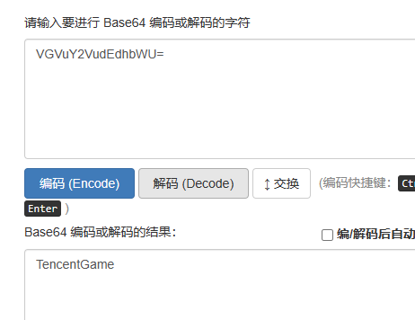

解码结果为TencentGame，初步猜测为结果

对于函数1F10:

其参数R0为输入字符串1，R1位字符串长度1。

在其函数内部

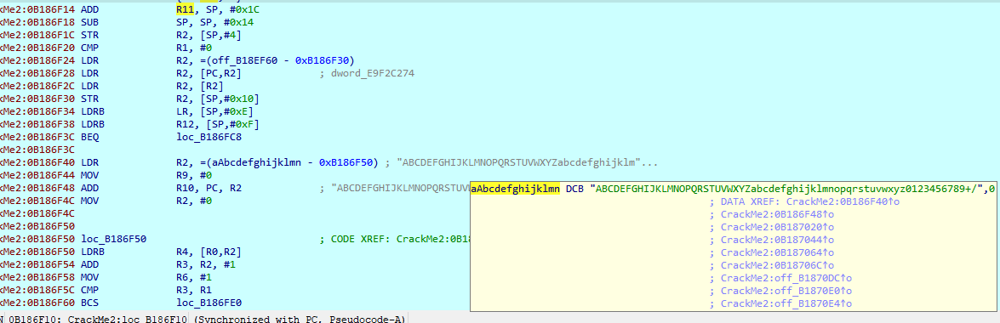

存在ABCDEFGHIJKLMNOPQRSTUVWXYZabcdefghijklmnopqrstuvwxyz0123456789+/

其应为base64加密函数

### 6、测试获取的结果

使用TencentGame进行测试，结果正确。

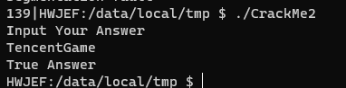
