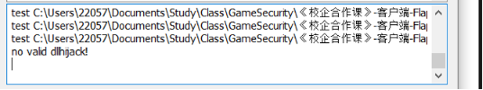
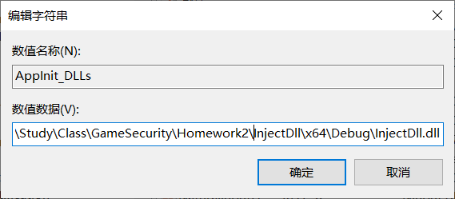
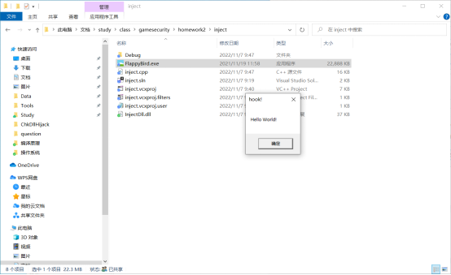
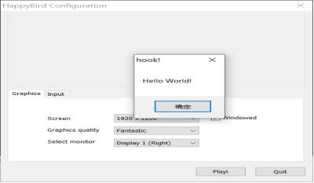
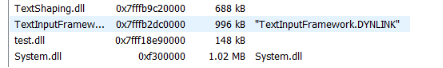
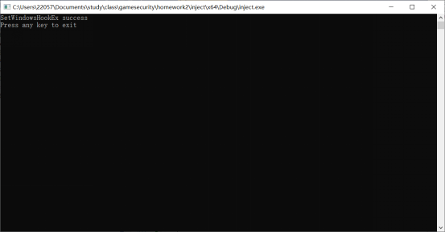
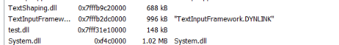
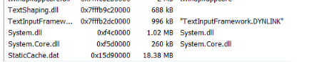
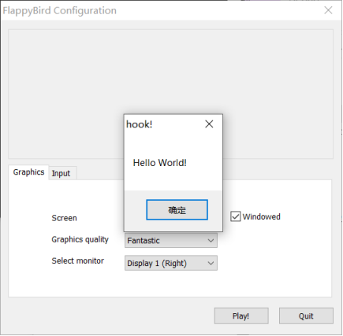
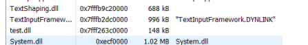

# 菁英班作业第2课

## 项目目录

assets: readme图片目录

inject: 注入程序

test: 弹窗dll

说明文档.pdf

## 一、弹窗DLL内容

test.dll实现在应用开始，结束时弹出Hello World!对话框。

```cpp
// dllmain.cpp : 定义 DLL 应用程序的入口点。
#include "pch.h"

BOOL APIENTRY DllMain( HMODULE hModule,
                       DWORD  ul_reason_for_call,
                       LPVOID lpReserved
                     )
{
    switch (ul_reason_for_call)
    {
    case DLL_PROCESS_ATTACH:
        DllInject();
        break;
    case DLL_THREAD_ATTACH:
    case DLL_THREAD_DETACH:
    case DLL_PROCESS_DETACH:
        break;
    }
    return TRUE;
}

void DllInject() {
    MessageBoxA(nullptr, "Hello World!", "hook!", 0);
}
```

```cmake
//framework.h
#pragma once

#define WIN32_LEAN_AND_MEAN             // 从 Windows 头文件中排除极少使用的内容
// Windows 头文件
#include <windows.h>

extern "C" __declspec(dllexport) void DllInject(void); //导出函数
```

## 二、静态注入方法

### 1、导入表注入

通过010editor查看FlappyBird.exe二进制格式发现最后一个节表头后面仅剩余56个字节，无法插入新的字节。

### 2、DLL劫持注入

通过x64dbg获取应用加载的所有动态链接库，如下：

> C:\Windows\System32\advapi32.dll
>
> C:\Windows\System32\bcrypt.dll
>
> C:\Windows\System32\bcryptprimitives.dll
>
> C:\Windows\System32\cfgmgr32.dll
>
> C:\Windows\System32\combase.dll
>
> C:\Windows\System32\dnsapi.dll
>
> C:\Users\22057\Documents\Study\Class\GameSecurity\《校企合作课》-客户端-FlappyBird\FlappyBird.exe
>
> C:\Windows\System32\gdi32.dll
>
> C:\Windows\System32\gdi32full.dll
>
> C:\Windows\System32\glu32.dll
>
> C:\Windows\System32\hid.dll
>
> C:\Windows\System32\imm32.dll
>
> C:\Windows\System32\IPHLPAPI.DLL
>
> C:\Windows\System32\kernel.appcore.dll
>
> C:\Windows\System32\kernel32.dll
>
> C:\Windows\System32\KernelBase.dll
>
> C:\Users\22057\Documents\Study\Class\GameSecurity\《校企合作课》-客户端-FlappyBird\FlappyBird_Data\Mono\EmbedRuntime\mono.dll
>
> C:\Users\22057\Documents\Study\Class\GameSecurity\《校企合作课》-客户端-FlappyBird\FlappyBird_Data\Mono\EmbedRuntime\mono_original.dll
>
> C:\Windows\System32\msvcp140.dll
>
> C:\Windows\System32\msvcp_win.dll
>
> C:\Windows\System32\msvcrt.dll
>
> C:\Windows\System32\mswsock.dll
>
> C:\Windows\System32\nsi.dll
>
> C:\Windows\System32\ntdll.dll
>
> C:\Windows\System32\ole32.dll
>
> C:\Windows\System32\oleaut32.dll
>
> C:\Windows\System32\opengl32.dll
>
> C:\Windows\System32\psapi.dll
>
> C:\Windows\System32\rpcrt4.dll
>
> C:\Windows\System32\sechost.dll
>
> C:\Windows\System32\setupapi.dll
>
> C:\Windows\System32\SHCore.dll
>
> C:\Windows\System32\shell32.dll
>
> C:\Windows\System32\shlwapi.dll
>
> C:\Windows\System32\ucrtbase.dll
>
> C:\Windows\System32\user32.dll
>
> C:\Windows\System32\uxtheme.dll
>
> C:\Windows\System32\vcruntime140.dll
>
> C:\Windows\System32\vcruntime140_1.dll
>
> C:\Windows\System32\version.dll
>
> C:\Windows\System32\win32u.dll
>
> C:\Windows\System32\winhttp.dll
>
> C:\Windows\System32\winmm.dll
>
> C:\Windows\System32\ws2_32.dll

通过ChkDllHijack进行自动分析，发现没有可以用于劫持的链接库，故此方法无法实施。



### 3、注册表注入

修改注册表计算机\HKEY_LOCAL_MACHINE\SOFTWARE\Microsoft\Windows NT\CurrentVersion\Windows下的Appint_DLLs和LoadAppInit_DLLs项目。

将AppInit_DLLs改为要注入Dll的路径，LoadAppInit_DLLs改为1，加载对应DLL。




注入结果：



## 三、动态注入方法

### 1、远程线程注入

首先通过进程的名称获得进程PID，再使用Create Remote Thread函数在目的进程上创建线程，将DLL远程注入。

代码如下:

```cpp
// 远程线程注入
bool remoteInjectDll(LPTSTR dst, LPCTSTR  szDllPath)
{
	DWORD dwPID = getPid(dst);
	HANDLE hProcess = NULL, hThread = NULL;
	HMODULE hMod = NULL;
	LPVOID pRemoteBuf = NULL;
	DWORD dwBufSize = (DWORD)(_tcslen(szDllPath) + 1) * sizeof(TCHAR);
	LPTHREAD_START_ROUTINE pThreadProc;
	// Open target process to inject dll
	if (!(hProcess = OpenProcess(PROCESS_ALL_ACCESS, FALSE, dwPID)))
	{
		_tprintf(L"Fail to open process %d ! [%d]\n", dwPID, GetLastError());
		return FALSE;
	}
	// Allocate memory in the remote process big enough for the DLL path name
	pRemoteBuf = VirtualAllocEx(hProcess, NULL, dwBufSize, MEM_COMMIT, PAGE_READWRITE);
	// Write the DLL path name to the space allocated in the target process
	WriteProcessMemory(hProcess, pRemoteBuf, (LPVOID)szDllPath, dwBufSize, NULL);
	// Find the address of LoadLibrary in target process(same to this process)
	hMod = GetModuleHandle(L"kernel32.dll");
	pThreadProc = (LPTHREAD_START_ROUTINE)GetProcAddress(hMod, "LoadLibraryW");
	// Create a remote thread in target process
	hThread = CreateRemoteThread(hProcess, NULL, 0, pThreadProc, pRemoteBuf, 0, NULL);
	WaitForSingleObject(hThread, INFINITE);
	CloseHandle(hThread);
	VirtualFreeEx(hProcess, pRemoteBuf, 0, MEM_RELEASE);
	CloseHandle(hProcess);
	return TRUE;
}
```

注入结果：



通过process Hacker查看发现dll已成功注入。



### 2、消息狗子注入

首先需要使用SPY++来获取目标进程的窗口类型和窗口名，FlappyBird主窗口类型为#32770 (对话框)，名称为FlappyBird Configuration。由于窗口类型较为宽泛，这里使用窗口名称作为句柄获取方法。

使用FindWindow(NULL, L"FlappyBird Configuration")获取窗口句柄，接着获取进程的pid，tid，获取Dll的导出函数，最后将钩子与导出函数绑定，发送窗口信息来运行导出函数。

```cpp
// 消息钩子注入
int setWindowHookEx_inject(WCHAR *dllPath)
{
	HWND hwnd = FindWindow(NULL, L"FlappyBird Configuration");
	if (hwnd == NULL)
	{
		std::cout << "FindWindow failed" << std::endl;
		return 0;
	}
	DWORD pid = NULL;
	DWORD tid = GetWindowThreadProcessId(hwnd, &pid);
	if (tid == NULL)
	{
		std::cout << "GetWindowThreadProcessId failed" << std::endl;
		return 0;
	}
	HMODULE dll = LoadLibraryEx(dllPath, NULL, DONT_RESOLVE_DLL_REFERENCES);
	if (dll == NULL)
	{
		std::cout << "LoadLibraryEx failed" << std::endl;
		return 0;
	}
	HOOKPROC addr = (HOOKPROC)GetProcAddress(dll, "DllInject");
	if (addr == NULL)
	{
		std::cout << "GetProcAddress failed" << std::endl;
		return 0;
	}
	HHOOK handle = SetWindowsHookEx(WH_GETMESSAGE, addr, dll, tid);
	if (handle == NULL)
	{
		std::cout << "SetWindowsHookEx failed" << std::endl;
		return 0;
	}
	PostThreadMessage(tid, WM_NULL, 0, 0);
	std::cout << "SetWindowsHookEx success" << std::endl;
	std::cout << "Press any key to exit" << std::endl;
	getchar();
	BOOL unhook = UnhookWindowsHookEx(handle);
	if (unhook == FALSE)
	{
		std::cout << "UnhookWindowsHookEx failed" << std::endl;
		return 0;
	}
	return 1;
}	
```

注入结果:




process hacker显示已成功加载dll。



输入任意键释放钩子。

dll被卸载。



### 3、APC注入

首先通过进程名得到其PID，在通过PID获取到所有的tid。遍历tid，寻找合适的线程，插入APC，来注入DLL。

```cpp
// APC 注入
void apc_inject(WCHAR* dst, WCHAR* dllPath)
{
	DWORD pid = getPid(dst);
	if (pid == 0)
	{
		std::cout << "getPid failed" << std::endl;
		return;
	}
	std::vector<DWORD> tids = getTids(pid);
	if (tids.size() == 0)
	{
		std::cout << "getTids failed" << std::endl;
		return;
	}
	
	HANDLE hProcess = OpenProcess(PROCESS_VM_WRITE|PROCESS_VM_OPERATION, FALSE, pid);
	auto p = VirtualAllocEx(hProcess, NULL, 1 << 12, MEM_COMMIT|MEM_RESERVE, PAGE_READWRITE);
	WriteProcessMemory(hProcess, p, dllPath, 2 * wcslen(dllPath) + 1, NULL);
	for (auto tid : tids)
	{
		HANDLE hThread = OpenThread(THREAD_SET_CONTEXT, FALSE, tid);
		if (hThread)
		{
			QueueUserAPC((PAPCFUNC)GetProcAddress(GetModuleHandle(L"kernel32"), "LoadLibraryW"), hThread, (ULONG_PTR)p);
		}
	}
	VirtualFreeEx(hProcess, p, 0, MEM_RELEASE);
}
```

注入结果:



成功加载dll

