# 菁英班作业第3课

## 环境

逍遥模拟器8.1.0

Xposed 89版框架

frida 16.0.8

## 项目目录

Frida_test: Frida 注入脚本目录

xposeddemo: xposed注入模块

assets: 说明文档图片目录

说明文档.pdf

## 一、初步分析

X86demo APP文本框显示Hello from C++。

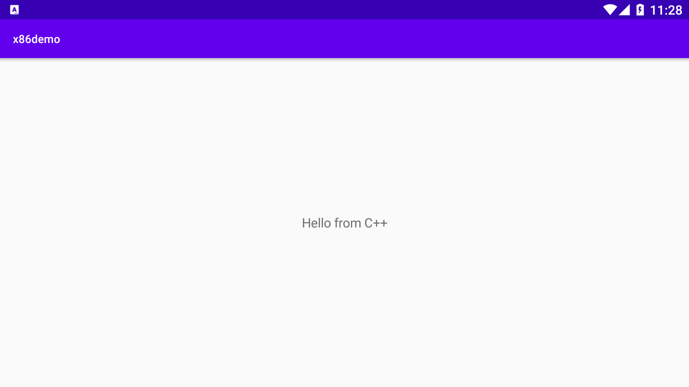

目的修改文本框内容为Hello from fqh

### 1、通过jadx进行逆向分析

项目目录：

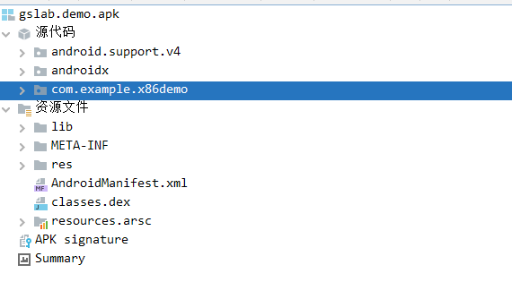

APP包名为com.example.x86demo


只有一个主活动MainActivity

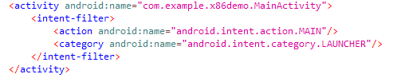

### 2、分析活动MainActivity

MainActivity源代码

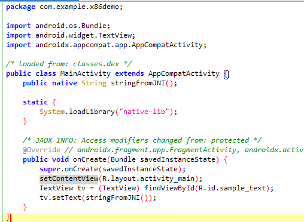

首先加载native-lib库，从库中导出函数stringFromJNI()

初始化过程中，通过属性sample_text获取文本框

通过stringFromJNI()函数获取字符串

通过setText()函数设置字符串

hook 思路：

1. 对stringFromJNI()函数进行hook,将返回值替换为我们想要的
2. 对setText()函数进行返回，将参数替换为我们想要的

### 3、IDA逆向分析native-lib.so

查找其导出函数stringFromJNI


进行反编译：

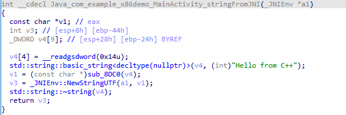

可知其直接返回字符串"Hello from C++"

## 二、Frida注入脚本

### 1、环境配置

略：adb连接，传送frida_server

pip安装frida

启动frida_server

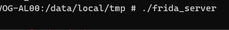

```shell
firda-ps -U
```

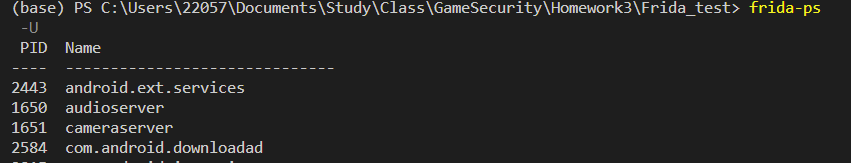

已正常连接

### 2、hook stringFromJNI函数

s1.js脚本

```js
console.log("Script loaded successfully ");
Java.perform(function x() {
    console.log("Inside java perform function");
    // 1:通过重写stringFromJNI方法来hook
    var myClass = Java.use("com.example.x86demo.MainActivity");
    myClass.stringFromJNI.implementation = function () {
        console.log("Inside stringFromJNI implementation");
        console.log("hook from fqh")
        var retval = "Hello from fqh"
        return retval;
    };
});
```

启动程序并附加脚本

```shell
frida -U -f com.example.x86demo -l .\s1.js
```

命令行输出hook信息

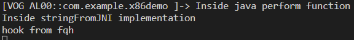

app内字符串修改


### 3、hook setText函数

因调用setText函数位置较多，需要对参数进行判断才能指定修改

s2.js

```js
console.log("Script loaded successfully ");
Java.perform(function x() {
    console.log("Inside java perform function");
    // 2:通过hook setText方法来hook
    // 2.1:获取TextView类
    var tv_class = Java.use("android.widget.TextView");
    // 2.2:重写setText方法
    tv_class.setText.overload("java.lang.CharSequence").implementation = function (x) {
        // 2.3:打印日志
        console.log("Inside setText implementation");
        console.log("hook from fqh!")
        console.log("x:" + x);
        // 判断x是否为"Hello from C++"
        if (x == "Hello from C++")
        // 如果是，就返回"Hello from fqh"
            x = Java.use("java.lang.String").$new("Hello from fqh");
        return this.setText(x);
    };
});
```

启动程序并附加脚本

```shell
frida -U -f com.example.x86demo -l .\s2.js
```

命令行输出hook信息，因调用setText位置较多，hook日志也较多

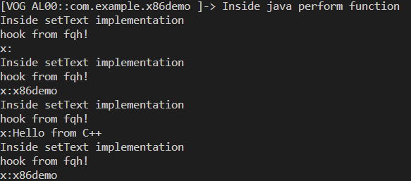

APP内显示字符串已被修改

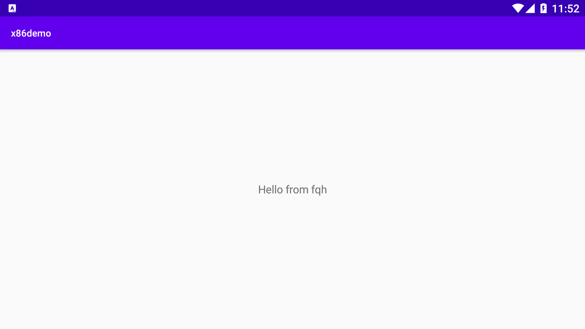

## 三、Xposed模块注入

### 1、虚拟机上安装Xposed框架

安装过程略

### 2、创建Xposed模块

创建项目com.xposed.xposeddemo

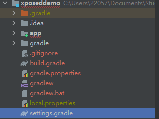

进行Xposed基本配置

```xml
<meta-data
            android:name="xposedmodule"
            android:value="true" />
        <meta-data
            android:name="xposeddescription"
            android:value="Hook x86demo" />
        <meta-data
            android:name="xposedminversion"
            android:value="53" />
```

```
    compileOnly 'de.robv.android.xposed:api:82'
    compileOnly 'de.robv.android.xposed:api:82:sources'
```

新建java类com.xposed.xposeddemo.HookDemo对stringFromJNI进行hook

```java
package com.xposed.xposeddemo;

import de.robv.android.xposed.IXposedHookLoadPackage;
import de.robv.android.xposed.XC_MethodHook;
import de.robv.android.xposed.XposedBridge;
import de.robv.android.xposed.XposedHelpers;
import de.robv.android.xposed.callbacks.XC_LoadPackage.LoadPackageParam;

public class HookDemo implements IXposedHookLoadPackage {
    public void handleLoadPackage(LoadPackageParam lpparam) throws Throwable {
        XposedBridge.log("Loaded app: " + lpparam.packageName);
//        hook 进入com.example.x86demo
        if (lpparam.packageName.equals("com.example.x86demo")) {
//            获取MainActivity类
            Class clazz = lpparam.classLoader.loadClass(
                    "com.example.x86demo.MainActivity");
//            对stringFromJNI函数进行hook
            XposedHelpers.findAndHookMethod(clazz, "stringFromJNI", new XC_MethodHook() {
                protected void beforeHookedMethod(MethodHookParam param) throws Throwable {
                    super.beforeHookedMethod(param);
                }
                protected void afterHookedMethod(MethodHookParam param) throws Throwable {
//                    修改返回值
                    param.setResult("Hello from fqh");
                }
            });
        }
    }
}

```

### 3、测试

安卓模拟器安装xposeddemo


Xposed启用该模块并重启


打开应用

APP字符串已被修改

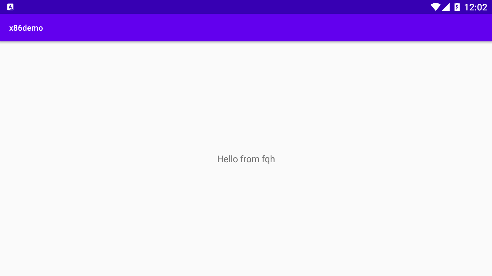

调试信息正常输出

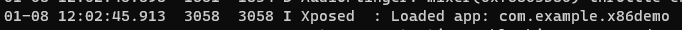

