---
班级：网安2002班
学号：U202012043
姓名：范启航
---

# 菁英班作业第4课

对FlappyBird游戏进行逆向分析，修改当局的分数

## 一、使用CE数据查询手动修改分数

### 1、将CE附加到FlappyBird上

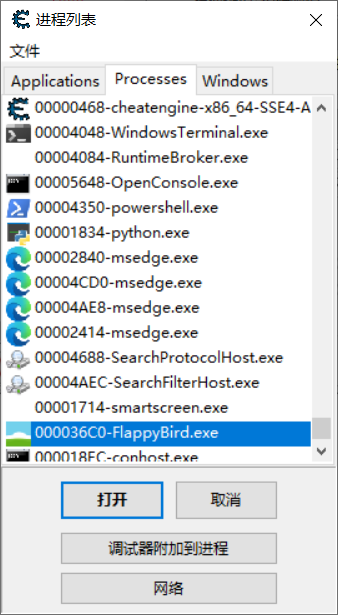

### 2、搜索数值找到存储score的位置

通过score不同值变化进行多次搜索

当前score数值为5

搜索时只有一个结果，即为Score的存储位置

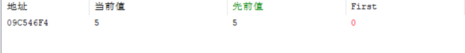

将Score值修改为1000

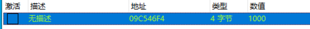

附加调试器，判断哪个地方代码访问了该地址

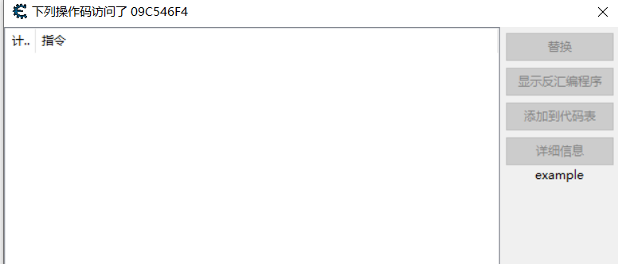

修改成功，死亡时分数值为1000。

### 3、固定化Score的位置

调试器发现此处地址0999BED0访问了该数据。

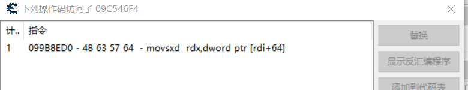

初步判断rdi存放有该对象的基地址，0x64为该score属性偏移地址。

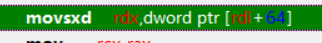

在此位置设置断点，当程序下次访问时，在此暂停。

重开游戏，让小鸟死亡。

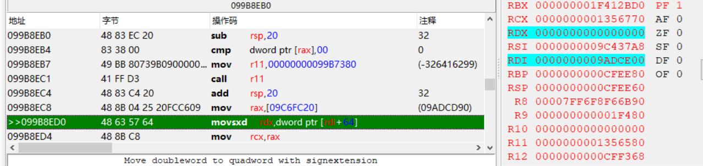

显示rdi寄存器为9ADCE00,应为此次游戏小鸟对象的基地址。

在内存空间查看这一片地址。

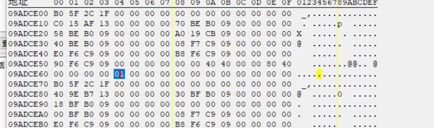

9ADCE64位置处恰好为1，验证判断正确。

接下来寻找内存中哪个地方存储了小鸟对象的基地址。

搜索数值为9ADCE00的内存位置

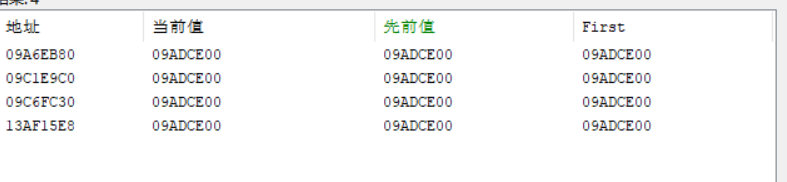

有四处均存储了该数据，先全部添加进备选列表内。

重启游戏，使小鸟Score 为1，暂停。

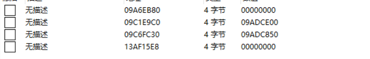

四个地址中有2个为0，2个发生了变化，分别查找两个不为0的区域。

0x09ADCE00位置处如下图所示，对应0x64偏移处值为1

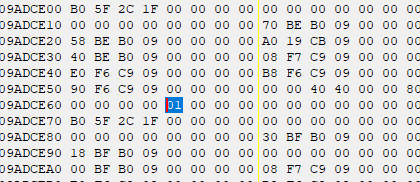

0x09ADC850位置处如下图所示，对应0x64偏移处值也为1

暂时无法确定，使小鸟死亡，二者值未发生变化。

重启一局，去掉两个0值，重新判断

发现两个地址处结果均为0x9A1C460,此时小鸟score为2，对应0x64偏移处结果也为2，判断这两个地址存放都是小鸟的基地址（存疑）

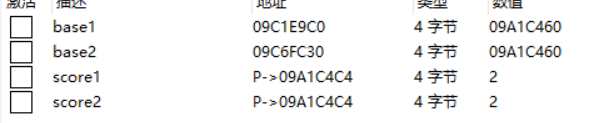

重开一局测试

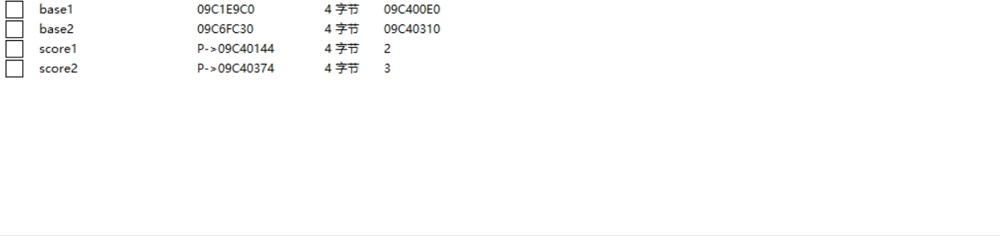

多次测试后，发现存在一定规律，每两局游戏时，其中一局这两个地址一样的，而其中另一局这两个数值不同，不同的这一局分数为上一局的分数。

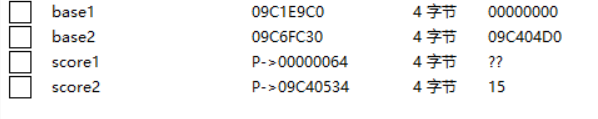

多次测试后，第一个位置变为0，故base1应为临时地址，删去，base2才是真实地址。将score改为777进行测试

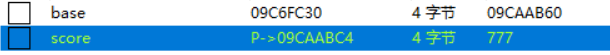

分数刷新后，数值改为778

## 二、使用CE修改汇编代码

### 1、使用dnspy找到计分规则函数

将Flappy Bird的Assembly-CSharp.dll拖入dnspy中进行反编译

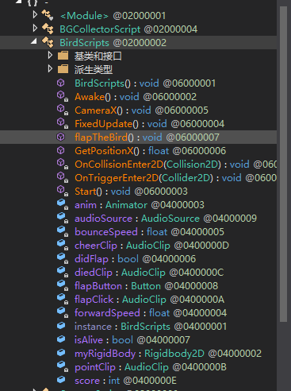

发现其存在BirdScripts这一主要类

找到score属性字段

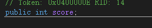

进行交叉查找看那一部分修改了此属性

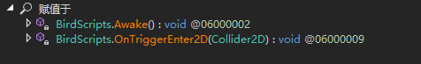

发现这两个函数修改了此属性。

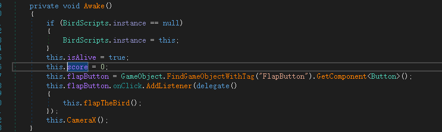

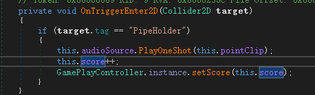

其中Awake函数为初始化该score为0

而OnTriggerEnter2D为分数增加。

故对OnTriggerEnter2D函数进行分析修改。

### 2、CE中修改OnTriggerEnter2D

在CE中找到该函数的代码段

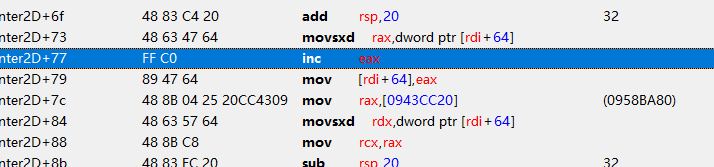

rdi为鸟对象实例，而rdi+64即为score地址

将score赋值给rax后，对eax自加，则赋值会rdi+64。

此处应为修改score部分，修改汇编指令inc eax为add eax, 500，即可实现每次通过管道后后加501分

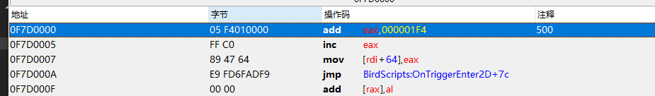

通过2个管道后，即可实现加1002分

## 三、使用UnityExplorer调试游戏程序集

### 1、使用MelonLoader对游戏进行修改

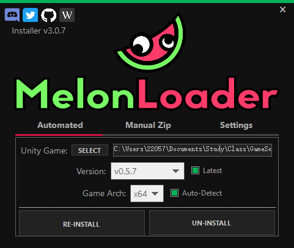

### 2、将UnityExplorer加入mods和libs中

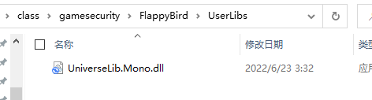

### 3、使用UnityExplorer进行修改分数

修改分数为100并应用

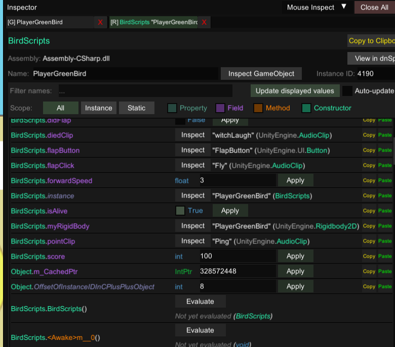

修改分数成功

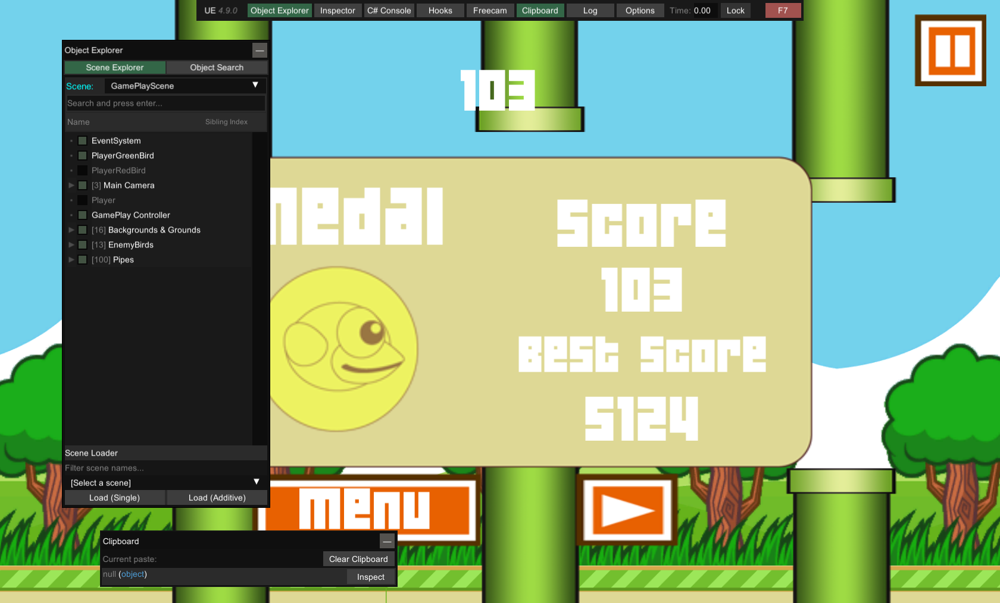

