---
班级：网安2002班
学号：U202012043
姓名：范启航
---

# 菁英班作业第6课

unity游戏（FlappyBird），反编译程序集，实现小鸟和管道无碰撞。

## 一、使用程序集注入方式修改小鸟

### 1、编写注入函数

Loader.cs

```c#
namespace InjectDll
{
    public class Loader
    {
        static UnityEngine.GameObject gameObject;
        public static void Load()
        {
            gameObject = new UnityEngine.GameObject();
            gameObject.AddComponent<Cheat>();
            UnityEngine.Object.DontDestroyOnLoad(gameObject);
        }
        public static void Unload()
        {
            UnityEngine.Object.Destroy(gameObject);
        }
    }
}
```

cheat.cs

```c#
public class Cheat : UnityEngine.MonoBehaviour
    {
        private void OnGUI()
        {
            UnityEngine.GUI.Label(new Rect(0, 0, 100, 100), "Hack!\nPress F1: score + 1000\nPress F2: 无敌\nPress F3: 取消无敌");
        }
        public void FixedUpdate()
        {
            if (UnityEngine.Input.GetKeyDown(KeyCode.F1))
            {
                //分数 + 1000
                var bs = UnityEngine.GameObject.FindWithTag("Player").GetComponent<BirdScripts>();
                if (bs != null)
                {
                    bs.score = bs.score + 1000;
                }
            }
            if (UnityEngine.Input.GetKeyDown(KeyCode.F2))
            {
                // 无敌
                var Player = UnityEngine.GameObject.FindWithTag("Player");
                var bs = Player.GetComponent<BirdScripts>();
                Player.GetComponent<Collider2D>().isTrigger = true;
            }
            if (UnityEngine.Input.GetKeyDown(KeyCode.F3))
            {
                //取消无敌
                var Player = UnityEngine.GameObject.FindWithTag("Player");
                var bs = Player.GetComponent<BirdScripts>();
                Player.GetComponent<Collider2D>().isTrigger = false;
            }
        }
    }
```

通过读取按键F2：来搜索Player对象，使对象的Collider2D的触发器打开，取消检测物理碰撞。

### 2、使用sharpMonoInjector进行注入

将注入程序集编译为dll

使用sharpMonoInjector进行注入

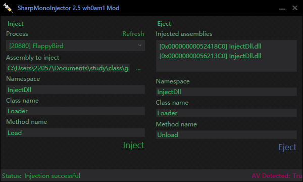

注入成功，左上角显示输出信息

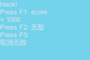

### 3、测试

进入游戏后，按F2后，小鸟与管道无碰撞。测试成功

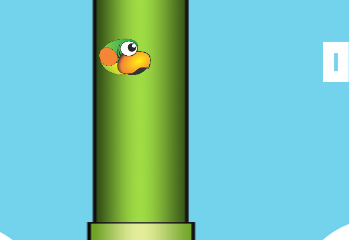

## 二、使用程序集注入方式修改管道

基本方法同上，通过注入程序集来修改管道的属性进行无碰撞行为。

操作方法略，仅展示思路。

### 1、将管道全部销毁，可行

```c#
var Pipes = UnityEngine.GameObject.FindGameObjectsWithTag("Pipe");
// 输出管道数量
UnityEngine.Debug.Log(Pipes.Length);
foreach (var pipe in Pipes)
{
    // 删除所有管道，可行
    GameObject.Destroy(pipe);
}
```

### 2、将管道碰撞触发器打开

```c#
var Pipes = UnityEngine.GameObject.FindGameObjectsWithTag("Pipe");
// 输出管道数量
UnityEngine.Debug.Log(Pipes.Length);
foreach (var pipe in Pipes)
{
	try
	{
    	pipe.GetComponent<Collider2D>().isTrigger = true;
	}
    catch (Exception e)
    {
        UnityEngine.Debug.Log(e);
    }
}
```

### 3、将管道2D碰撞模型关闭

```c#
var Pipes = UnityEngine.GameObject.FindGameObjectsWithTag("Pipe");
// 输出管道数量
UnityEngine.Debug.Log(Pipes.Length);
foreach (var pipe in Pipes)
{
	try
    {
        pipe.GetComponent<Collider2D>().enabled = false;
    }
    catch (Exception e)
    {
        UnityEngine.Debug.Log(e);
    }
}
```

### 4、注入并测试

注入FlappyBird

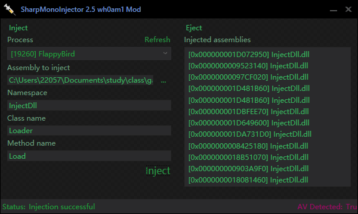

将管道全部销毁后，不会发生碰撞，但PipeHolder依然存在，可以实现正常得分。

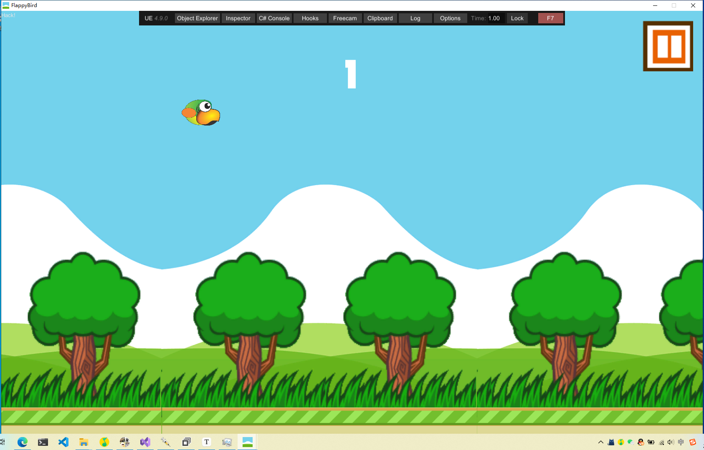

## 三、修改汇编指令

此方法可实现碰撞后小鸟不死。

### 1、分析碰撞响应函数

对小鸟的Awake属性进行分析，发现onCollisionEnter2D函数对其进行了调用。

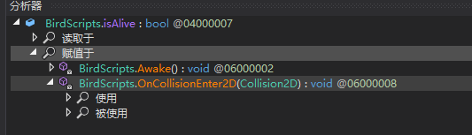

查看此函数，分析其应当为碰撞后调用的函数，该函数存在两个判断语句，分别判断碰撞物类型与标志符。

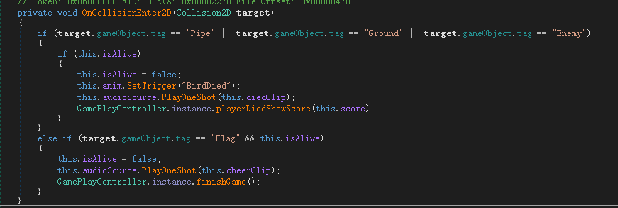

若此函数不经过中间的判断，调用语句直接返回，则可实现小鸟的不死。

或者在第一个判断处，进行相反的跳转指令。

### 2、修改汇编指令跳过判断操作

1：找到该函数对应的汇编指令地址

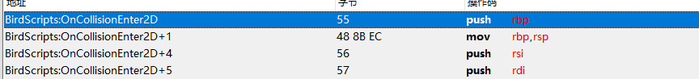

在函数开头加一局跳转指令至函数的结尾

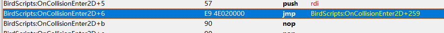

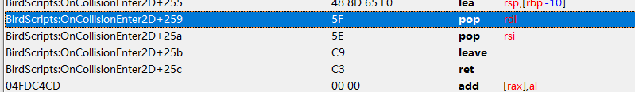

即可实现该函数中间部分不做调用。

2：或将je改为jne进行错误跳转

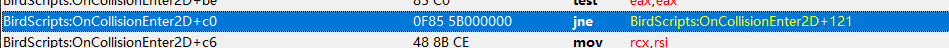

### 3、测试

此时小鸟与管道碰撞时不会死亡，实现了不死

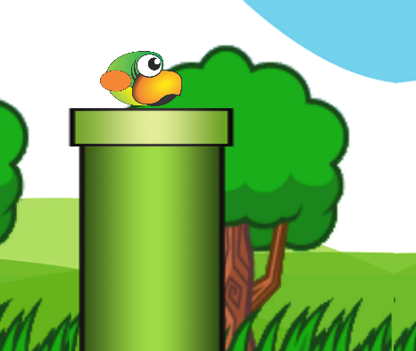

## 四、使用dnspy回编译

同上述方法，删除第一个if判断语句。

通过dnspy直接修改源代码，并进行回编译。

将会编译后的Assembly-Csharp进行替换

### 1、修改碰撞响应函数

删除第一个if判断语句。

此处不能删除第二个，否则游戏将无法进入

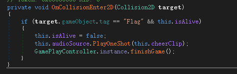

### 2、进行回编译

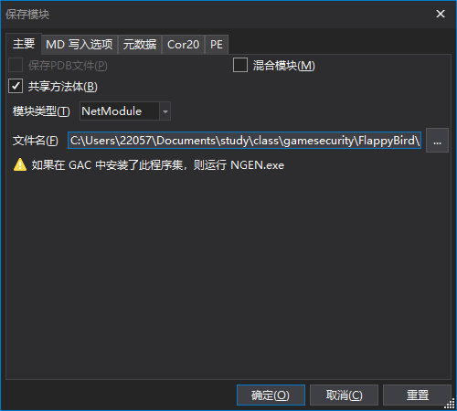

### 3、将DLL进行替换

替换原文件夹内DLL

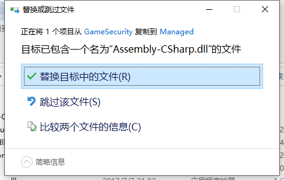

### 4、测试

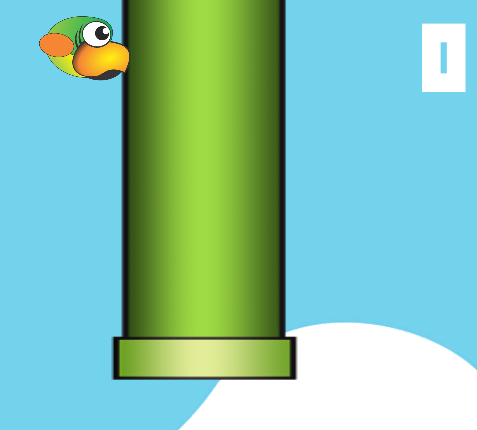

小鸟无敌，不会死亡
